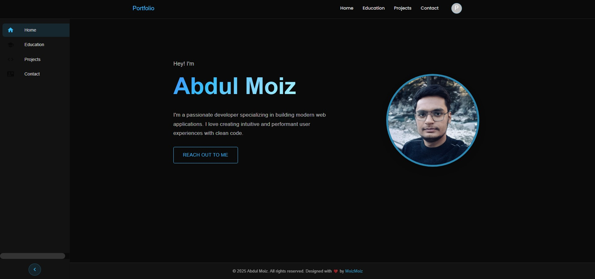
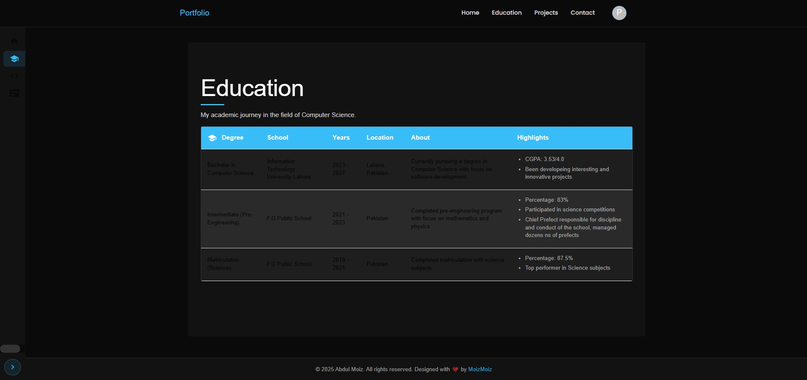
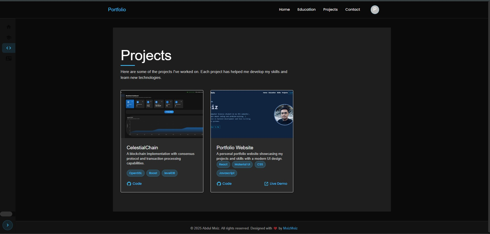
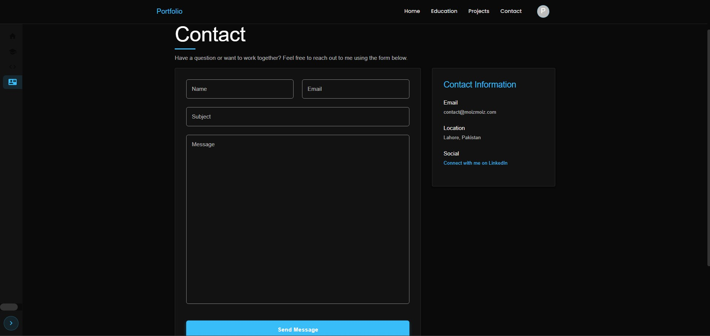
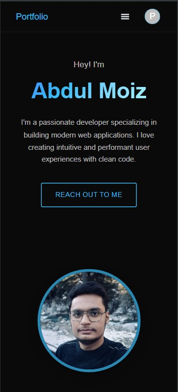
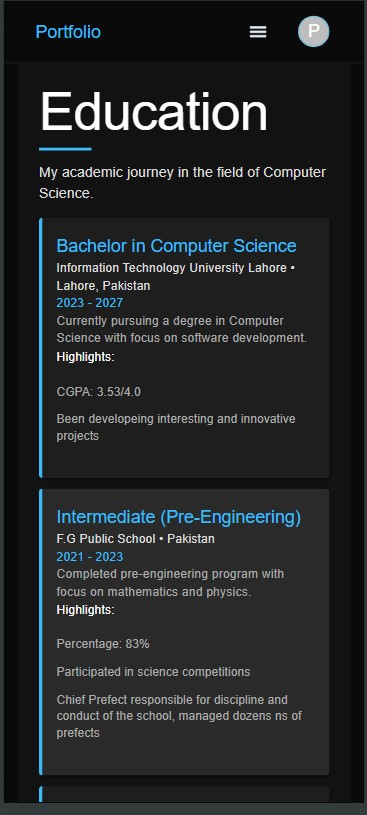
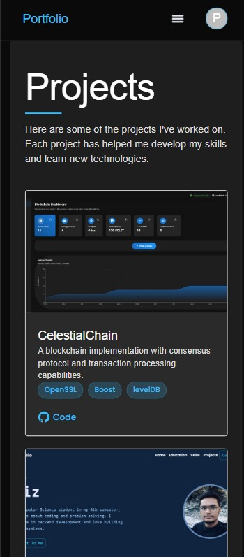
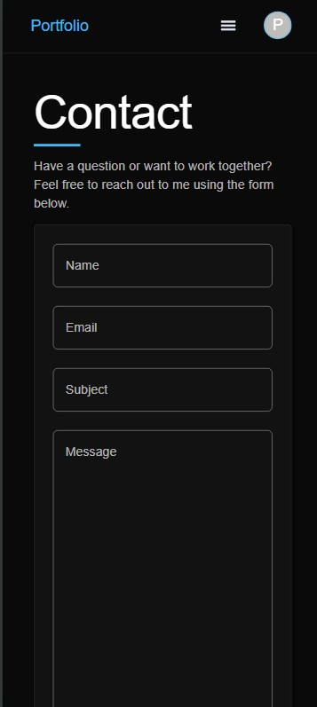
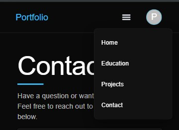
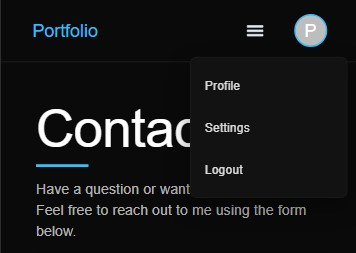

# React Portfolio

A modern, responsive portfolio website built with React and Material UI.



## ✨ Features

- Responsive design that works on all devices (mobile, tablet, desktop)
- Dynamic navigation with mobile-friendly hamburger menu
- Interactive project cards with hover effects
- Structured education timeline with alternating rows
- Contact form with validation
- Context API for dynamic page title updates
- Clean, modern UI with subtle animations

## 🛠️ Technologies Used

- React 18
- React Router DOM v6
- Material UI
- CSS with component-specific styling
- Context API for state management

## 📋 Getting Started

### Prerequisites

- Node.js (v16 or later)
- npm or yarn

### Installation

1. Clone the repository
```bash
git clone https://github.com/moizmoizdev/portfolio-v2.git
cd portfolio-v2
```

2. Install dependencies
```bash
npm install
```

3. Start the development server
```bash
npm start
```

4. Open your browser and visit `http://localhost:3000`

## 📱 Responsive Design

The portfolio is fully responsive with different layouts for:
- Mobile devices (<600px)
- Tablets (600px - 900px)
- Desktops (>900px)

## 🧩 Project Structure

```
src/
├── components/
│   ├── layout/        # Layout components
│   ├── sections/      # Page sections
│   └── ui/            # Reusable UI components
├── context/           # React Context API
├── pages/             # Page components
├── styles/            # Global styles
└── App.js             # Main App component
```

## 📸 Screenshots

## Desktop View





## Mobile View







## 🔧 Future Improvements

- Dark/light mode toggle
- More animations and transitions
- Blog section
- Filterable projects

## 📄 License

This project is licensed under the MIT License - see the LICENSE file for details.

---

Made with ❤️ by Abdul Moiz
